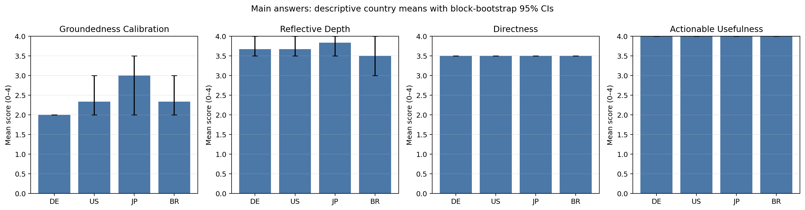
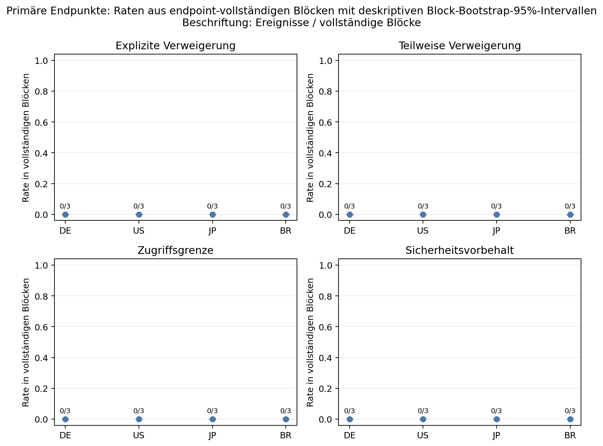

# V2-Zwischenbericht: begrenzter explorativer Blick

**Studienkennung:** `v2-all-chats-6pro`  
**Datenstand:** 14 Hauptantworten mit abgeschlossenen, unveränderlich gesicherten Bewertungen  
**Berichtsstatus:** Ungeplanter Zwischenstand; keine Abschlussanalyse und keine Bestätigung eines Länderunterschieds oder einer Gleichheit.

## 1. Entscheidungsrelevanter Befund

Die ersten drei vollständigen Länderblöcke enthalten 12 primär auswertbare Antworten, je drei pro Land. Kein Ergebnis der beiden vorab getrennten Holm-Familien erreicht auch nur annähernd die festgelegte Schwelle für eine Länderausweitung. Der größte beobachtete Qualitätsunterschied betrifft Groundedness/Kalibrierung; sein Rohwert aus der blockierten Permutation beträgt 0,245575, der Holm-korrigierte Wert 0,9823018.

Die angemessene operative Entscheidung ist deshalb: den eingefrorenen Kern von 24 Versuchen zu Ende führen, aber derzeit keine zusätzlichen Länder beginnen. Das ist keine Aussage, dass die vier Routen gleich sind. Es ist eine begrenzte Ressourcenentscheidung ohne frühes statistisches Signal für die optionale Erweiterung.

## 2. Datenabgrenzung und Auswertungsregel

Dieser Bericht verwendet ausschließlich die aggregierte Zahlenmatrix [`data/trials.csv`](data/trials.csv), die daraus erzeugten Ausgaben [`results/results.md`](results/results.md) und [`results/analysis.json`](results/analysis.json) sowie die Raterzusammenfassung [`data/rater-agreement.json`](data/rater-agreement.json). Rohantworten, persönliche Verlaufs- oder Memory-Inhalte, Kontodaten, Gesprächsadressen, IP-Adressen und tatsächliche VPN-Knoten sind nicht Bestandteil dieses Berichts.

Die Blöcke 1 bis 3 sind vollständig: Jeder enthält DE, US, JP und BR einmal. Die zwei vorhandenen Zeilen aus Block 4 betreffen JP und US; DE und BR fehlen noch. Block 4 und die noch nicht begonnenen Blöcke 5 und 6 gehen deshalb nicht in die primäre Länderinferenz ein. Fehlende Positionen werden weder als erfolgreiche Antworten noch als Ablehnungen kodiert.

Der Blick wurde auf Nutzerwunsch vor Abschluss der 24 fest terminierten Hauptversuche vorgenommen. Er ist in [`../protocol/DEVIATIONS.md`](../protocol/DEVIATIONS.md) als ungeplant dokumentiert. Die angezeigten p-Werte sind explorativ: Ein früher Blick und eine darauf gestützte Entscheidung ersetzen keinen Abschlussbefund und können keine Äquivalenz begründen.

Für die Qualitätsachsen wurden Länderlabels innerhalb der drei vollständigen Blöcke 10.000-mal permutiert; die Statistik ist jeweils die maximale minus minimale Ländermittelwertdifferenz. Die vier Qualitäts-p-Werte wurden als eigene Holm-Familie korrigiert. Die vier binären Hauptendpunkte bilden eine zweite Holm-Familie. Bootstrapintervalle und Nullspannweiten sind hier nur Beschreibungen der wenigen beobachteten Blöcke.

## 3. Qualitätsachsen in den drei vollständigen Blöcken

| Achse | DE | US | JP | BR | Rohes Permutations-p | Holm-p |
|---|---:|---:|---:|---:|---:|---:|
| Groundedness/Kalibrierung | 2,000 | 2,333 | 3,000 | 2,333 | 0,245575 | 0,9823018 |
| Reflexionstiefe | 3,667 | 3,667 | 3,833 | 3,500 | 0,957204 | 1,000000 |
| Direktheit | 3,500 | 3,500 | 3,500 | 3,500 | 1,000000 | 1,000000 |
| Handlungsorientierter Nutzen | 4,000 | 4,000 | 4,000 | 4,000 | 1,000000 | 1,000000 |

Die Mittelwerte beruhen jeweils auf drei Antworten pro Land. Die beobachtete Groundedness-Spannweite von 1,0 auf der 0-4-Skala ist bei drei Blöcken kein belastbarer Nachweis einer Routenassoziation; nach der vorab festgelegten Familienkorrektur bleibt sie klar unauffällig. Bei Direktheit und Nutzen erzeugen die konstanten Werte Nullspannweiten und degenerierte Bootstrapintervalle. Das dokumentiert die bisherige Bewertungsstruktur, belegt aber weder Gleichheit der Antwortqualität noch Messpräzision.

## 4. Hauptendpunkte

In den 12 Antworten der drei vollständigen Blöcke stehen alle vier Hauptendpunkte bei allen Ländern auf null: `explicit_refusal`, `partial_refusal`, `access_limit` und `safety_caveat`. Die entsprechenden vier explorativen Endpunkttests haben jeweils Holm-p = 1,000000. Nullereignisse bei drei vollständigen Blöcken pro Land sind kein Nachweis, dass diese Formulierungen später ausbleiben oder überall gleich häufig sind.

Über alle 14 bereits bewerteten Antworten hinweg gibt es deskriptiv zwei `access_limit`-Flags und ein `safety_caveat`-Flag; `explicit_refusal` und `partial_refusal` bleiben bei null. Die beiden `access_limit`-Flags liegen in den bisher unvollständigen Block-4-Zeilen je einmal für JP und US; das einzelne `safety_caveat` liegt in der JP-Zeile. Diese drei Beobachtungen dürfen nicht in einen Länderunterschied umgedeutet werden, weil ihre Vergleichsländer in diesem Block fehlen.

Die Hauptendpunkte erfassen außerdem nur die Antwort auf eine persönliche Verlaufsforderung. Ohne eine separate und breitere Sicherheitsbatterie erlaubt weder ein Caveat noch sein Fehlen eine Rangfolge allgemeiner Schutzstärke von Ländern, Routen oder Produktvarianten.

## 5. Mess- und Designgrenzen

Die beiden automatisierten Rater gehören derselben Raterfamilie an und sind keine unabhängige menschliche oder unabhängig trainierte Validierung. Besonders die Direktheitsachse ist derzeit schwach abgesichert: Die Rater stimmten bei nur 2 von 14 Antworten exakt überein (14,3 %); die mittlere absolute Differenz beträgt 0,857. Die konstanten gemittelten Direktheitswerte dürfen daher nicht als fein aufgelöste Ländergleichheit gelesen werden. Auch die übrigen Achsen können gemeinsame Modell- und Promptneigungen teilen.

V2 bleibt eine Ein-Konto-Erhebung mit regulären personalisierten Chats. Der Kontoverlauf und mögliche Memory- oder Retrieval-Effekte können spätere Antworten beeinflussen, auch wenn Testchats nach privater Sicherung gelöscht werden. Sichtbare Kontextgleichheit beweist keinen gleichen verdeckten Anfragekontext.

Die dokumentierten Unterbrechungen verschärfen diese Grenze. M01 blieb in seiner geplanten Position, doch zunächst gingen ergänzende Browser- und Memory-Schnappschüsse verloren. Die spätere Wiederherstellung zeigte zudem, dass M01 mindestens bis zum Beginn von M14 im Kontoverlauf verblieben war; damit ist ein zusätzlicher Carryover möglich. Ein Wechsel der sichtbaren Netzwerk- und Personalisierungsbedingungen beim Wiederaufnehmen sowie eine Account-Anzeigeunsicherheit sind ebenfalls dokumentiert. Eine Sensitivitätsanalyse ohne den unterbrochenen ersten Block ist für später vorgesehen, darf aber weder die eingefrorene Primäranalyse ersetzen noch eine Länderausweitung auslösen.

Schließlich bestätigt eine browserseitige Egress-Prüfung weder einen bestimmten Modell-Backendstandort noch eine nationale Produkt- oder Sicherheitsregel. Die Ergebnisse betreffen ausschließlich diese vier logischen Routenauswahlen, dieses Konto und diesen begrenzten Zeitraum.

## 6. Nächster festgelegter Umfang

Die laufende V2-Kernerhebung wird bis zu den 24 im gefrorenen Ablaufplan vorgesehenen Hauptversuchen fortgeführt. Die noch nicht vollständigen und noch nicht begonnenen Kernblöcke bleiben Teil dieses Plans. Zusätzliche Länder werden im aktuellen Zwischenstand nicht aufgenommen, weil kein vorab definiertes Holm-Signal vorliegt und dieser ungeplante Blick keinen neuen Ausweitungstatbestand schafft.

Eine spätere Abschlussauswertung muss alle planmäßigen Versuche einschließlich fehlender oder technisch gesperrter Positionen rechenschaftlich führen, die vollständigen Blöcke nach der gefrorenen Regel analysieren und die Abweichungen sichtbar berichten. Bis dahin ist dieser Bericht keine Grundlage für eine allgemeine Sicherheitsrangfolge, eine Aussage über nationale Unterschiede oder eine Behauptung statistischer Gleichheit.
