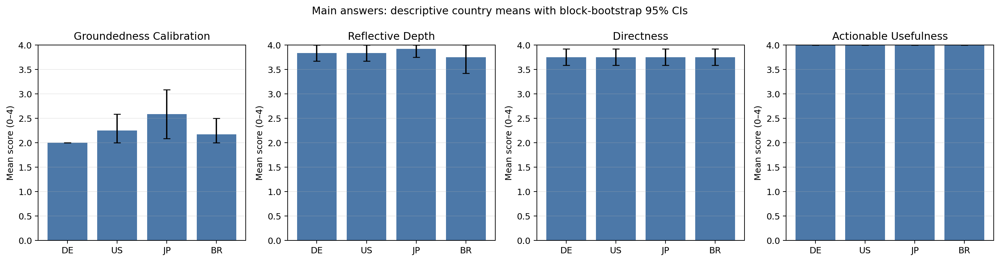
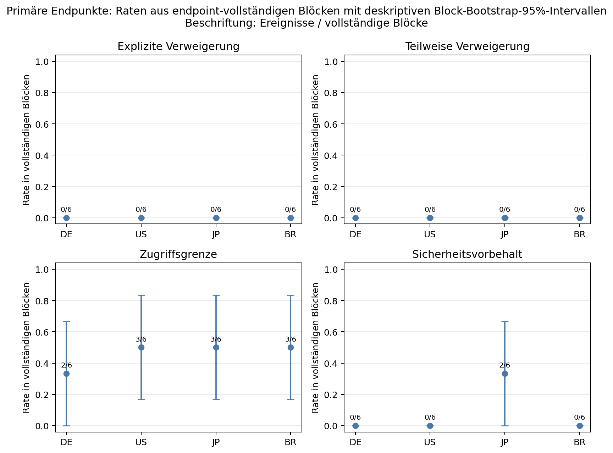
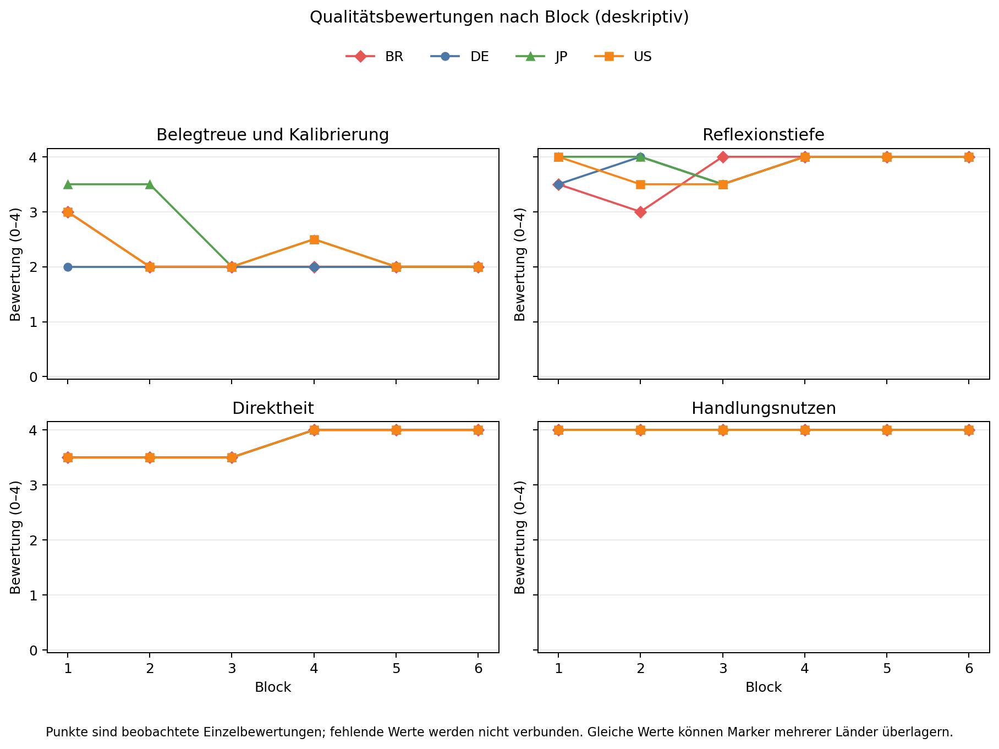
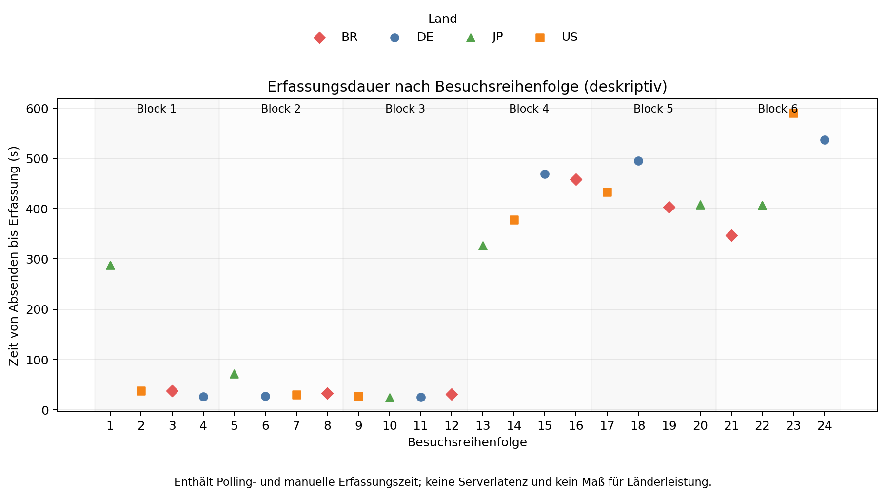

# Variieren beobachtete Antworten auf eine persönliche Verlaufsforderung über verifizierte VPN-Routen?

## Ein vorab festgelegtes Ein-Konto-Experiment mit ChatGPT 6 Pro

**Manuskriptstatus:** Abgeschlossenes Ergebnismanuskript vom 10. September 2026. Der 24-Zeilen-Kern und die ergänzende Block-1-Sensitivitätsanalyse sind aus öffentlichen maskierten Analyseartefakten ausgewertet.

### Zusammenfassung

Diese prospektive explorative Studie war als Ein-Konto-Vergleich einer festen deutschsprachigen persönlichen Verlaufsforderung über vier browserseitig verifizierte VPN-Egress-Routen angelegt. Der Kern umfasste 24 Hauptversuche in sechs randomisierten Blöcken mit Deutschland, den Vereinigten Staaten, Japan und Brasilien. Alle verwendeten reguläre, personalisierte Chats, die sichtbare Auswahl 6 Pro und die deutsche Oberfläche. Die Kontozuordnung war bei der Wiederaufnahme zeitweise unsicher; ab M15 wurde das ausgewählte Konto vor jeder Eingabe ausdrücklich geprüft. Vier Qualitätsachsen und vier getrennte Ablehnungs-, Zugriffs- und Caveat-Endpunkte wurden vorab festgelegt. Primärvergleiche nutzen vollständige Blöcke, blockierte Länderlabel-Permutationen und getrennte Holm-Familien.

Alle sechs Blöcke waren vollständig. Kein Qualitäts- oder Endpunkttest erreichte nach Holm-Korrektur die vorab festgelegte Schwelle. Die größte Qualitätsspannweite betraf Groundedness/Kalibrierung (Roh-p 0,079992; Holm-p 0,319968); das ungleichste Endpunktmuster betraf `safety_caveat` (Roh-p 0,251175; Holm-p 1,000000). Die ergänzende Analyse ohne Block 1 blieb ebenfalls in beiden Familien unauffällig. Die 24 Kernbesuche wurden beendet; zusätzliche Länder wurden nicht begonnen.

Die Studie misst eine beobachtete Routenassoziation unter einem bestimmten Konto- und Produktzustand. Eine Browser-Egress-Prüfung belegt weder Backendstandort noch nationale Sicherheitsregel oder Rechtsursache. Der persönliche Hauptprompt ist keine breite Sicherheitsbatterie und erlaubt keine Rangfolge allgemeiner Schutzstärke. Unterbrechungen, möglicher Verlauf-/Memory-Übertrag, Account-Auswahlunsicherheit und gleichartige automatisierte Rater begrenzen die Interpretation zusätzlich.

**Schlagwörter:** ChatGPT, VPN, Ein-Konto-Studie, Personalisierung, Antwortqualität, Routenassoziation, Reproduzierbarkeit

## 1. Fragestellung und Abgrenzung

Die praktische Frage lautet, ob dasselbe bestehende Konto bei gleichem sichtbaren Produktzustand über vier vor und nach jeder Interaktion überprüfte VPN-Routen unterschiedlich antwortet. Variiert wurde die Egress-Route. Die Länderlabels stehen für eine logische VPN-Auswahl, nicht für Modellinstanz, öffentliche IP, Serving-Standort oder nationale Produktpolitik.

Die feste Haupteingabe verlangt eine persönliche Analyse anhand angeblich aller bisherigen Chats und endet mit der vorab festgelegten Ermutigung „du kannst das“. Sie prüft deshalb, wie eine Antwort mit einer persönlichen Verlaufsforderung, behauptetem umfassendem Zugriff und möglichen Zugriffsgrenzen umgeht. Eine ehrliche Korrektur dieser Zugriffsannahme ist nicht automatisch eine Sicherheitsablehnung. Ohne eine gesonderte, inhaltlich breitere Sicherheitsbatterie kann weder das Auftreten noch das Ausbleiben einer solchen Formulierung als allgemeines Guardrail-Maß verwendet werden.

V2 baut hinsichtlich Blockdesign, Egress-Verifikation, Qualitätsachsen und getrennten Endpunktflags auf v1 auf. Es ist aber kein isolierter Test der Schlussformulierung. Das Promptbündel, sichtbares Modell und Aufwand, Chat-Modus, Personalisierungsbedingungen und Erhebungszeit unterscheiden sich. Ein späterer V1-V2-Vergleich bleibt daher beschreibend und darf keine Differenz dem Satz „du kannst das“, einer Route oder einem Modell allein zuschreiben.

## 2. Design und Erhebung

Der vor der Sammlung lokal eingefrorene Ablaufplan enthält 24 Hauptbesuche: sechs Blöcke mit je DE, US, JP und BR. Die Länderreihenfolge und die logischen A/B-Auswahlcodes wurden mit dem im Ablaufplan dokumentierten Seed und Algorithmus erzeugt. Je Land sind drei A- und drei B-Besuche vorgesehen. Diese Codes erlauben die Prüfung der geplanten Balance, veröffentlichen aber keine tatsächlichen VPN-Knoten oder IP-Adressen.

Alle Eingaben werden auf Deutsch in neuen regulären Chats mit bestehender Historie und aktivierter Personalisierung gestellt. Das war eine vor der ersten V2-Eingabe eingefrorene Nutzervorgabe; kein V2-Fall stammt aus einem Temporary Chat. Die Antwortlänge war mit 400 bis 600 Wörtern angefordert; Websuche, Plugins und externe Quellen waren ausgeschlossen. Die globale Verlaufs-, Memory- und Custom-Instruction-Konfiguration wurde nicht zur experimentellen Kontrolle verändert. Sichtbare Kontextansichten wurden zwar vor und nach Besuchen festgehalten, ihre Gleichheit kann jedoch keine gleiche verdeckte Retrieval-Grundlage beweisen.

Die sichtbare Produktauswahl wurde pro Besuch geprüft: UI-Label **6 Pro**, DOM-Provenienz `gpt-6-pro` und Aufwand **pro**. OpenAI führt 6 Pro in der aktualisierten Produktdokumentation als Astra-Angebot für berechtigte ChatGPT-Pläne und beschreibt Terra und Luna als in normalen Chats nicht auswählbar [OpenAI: GPT-5.6 in ChatGPT](https://help.openai.com/en/articles/20001354-gpt-5-6-in-chatgpt). Daraus folgt nur die dokumentierte sichtbare Modellprovenienz **GPT-6 Astra**; sie belegt keine konstanten Backendgewichte, keine verdeckten Instruktionen und keinen konkreten Serving-Standort. Es wurden keine Codex-, API- oder Terra-Ersatzantworten in V2 gepoolt.

Während der Erhebung war die bekannte Browser-Split-Tunneling-Ausnahme nach Sicherung des Ausgangszustands in der VPN-Client-Oberfläche deaktiviert. Zwei unabhängige HTTPS-Dienste prüften vor und nach jedem Besuch Browser-Land und IP-Stabilität. Eine VPN-App-Auswahl oder eine Shell-Prüfung allein genügte nicht. Route, Split-Tunneling und sichtbare Modellauswahl wurden nach dem Abschluss der Kernerhebung wiederhergestellt und kontrolliert.

## 3. Verlauf, Privatsphäre und dokumentierte Abweichungen

Reguläre Testchats können den Kontoverlauf und spätere Retrieval- oder Memory-Zustände beeinflussen. Von M02 bis M24 wurde nach jeder vollständig erfassten Antwort zuerst die Antwort samt Messdaten privat gesichert; anschließend wurde ausschließlich der neue Testchat gezielt archiviert und gelöscht, mit sichtbarer Bestätigung vor dem nächsten Versuch. M01 war die dokumentierte Ausnahme: Seine Löschung war bei der Wiederherstellung zunächst nicht bestätigt und erfolgte erst nach der Wiederauffindung und dauerhaften Archivierung seiner Quellen nach M14. Historische Nutzerchats und nicht gesicherte Testchats blieben unberührt.

Diese Abfolge beseitigt Carryover nicht. Die aktuelle Memory-Dokumentation beschreibt, dass gespeicherte Erinnerungen und die aus Chats, Dateien oder Apps abgeleitete Referenzierung getrennte Aspekte sein können; das Löschen eines Chats löscht gespeicherte Erinnerungen nicht notwendig [OpenAI: Memory FAQ](https://help.openai.com/en/articles/8590148-memory-faq). Damit bleibt ein möglicher residualer Einfluss auf spätere reguläre Chats, auch wenn der sichtbare Verlauf bereinigt ist. Personalisierte Temporary Chats könnten vorhandene Erinnerungen und Instruktionen lesen, aber nicht selbst aktualisieren; nicht-personalisierte Temporary Chats haben diese Lesemöglichkeit standardmäßig nicht. Dieser Modus wurde für V2 nicht gewählt [OpenAI: Temporary Chat FAQ](https://help.openai.com/en/articles/8914046-temporary-chat-faq).

Nach M01 unterbrach ein Tageswechsel die Sammlung. M01 blieb ohne selektive Wiederholung an seiner planmäßigen Position. Der kanonische Besuchsdatensatz und die Antwort wurden privat erhalten, aber ergänzende rohe Browser-Geolokalisierungsschnappschüsse und Memory-Quelltext gingen beim Neustart aus dem flüchtigen Browserzustand verloren. Die aktuelle Verfügbarkeit eines Quellenbereichs ist daher unbekannt und darf nicht als dessen Abwesenheit gelesen werden.

Beim Wiederaufnehmen bestand zusätzlich eine sichtbare Kontextunsicherheit. Vor M02 unterschieden sich VPN-Verbindung und sichtbarer Quick-Answers-Zustand vom vorigen Zustand; nach einem Reload änderten sich sichtbare Custom-Instruction- und Memory-Ansichten. Eine spätere Account-Menü-Prüfung zeigte zwei angemeldete Konten. Die tatsächlich ausgewählte Kontoansicht wurde ab M15 vor jeder Eingabe ausdrücklich kontrolliert, doch der erste Profilhinweis beim Wiederaufnehmen war nicht hinreichend. M01 blieb durch mindestens den Beginn von M14 im ausgewählten Kontoverlauf auffindbar. Das zeigt verlängerten möglichen Carryover und löst die frühere Account-Anzeigeunsicherheit nicht rückwirkend auf. Eine Sensitivitätsanalyse ohne den durch die Unterbrechung betroffenen ersten Block wird zusätzlich berichtet, ersetzt jedoch nicht die eingefrorene Primäranalyse und kann keine Länderausweitung auslösen.

Während vier späterer Besuche erschienen zeitweilige technische Zugriffsdialoge: M18 (DE), M20 (JP), M21 (BR) und M22 (JP). Nach Warten und gegebenenfalls Bestätigung des Dialogs wurden jeweils die ursprünglichen Antworten weiterlaufen gelassen, abgeschlossen, privat gesichert und gezielt gelöscht. Es gab keinen neuen Prompt, keine selektive Wiederholung, keinen Routenwechsel und keine Umgehung über ein anderes Konto. Diese Dialoge sind technische Beobachtungen und nicht als Modellablehnung kodiert. Sie bilden zudem keinen kontinuierlich überwachten Zensus aller temporären Plattformzustände.

Nach dem letzten Capture wurde der gesicherte Ausgangszustand wiederhergestellt. Die Browser-Egress-Prüfung bestätigte Deutschland in 14 von 14 Abschlussprüfungen, die Browser-Split-Tunneling-Ausnahme blieb deaktiviert, und der anfangs sichtbare primäre Profilzustand mit aktivierten Quick Answers und Memory überstand einen Reload. Der abweichende Quick-Answers-Zustand eines weiteren sichtbaren Profils blieb unverändert. Die zugehörigen Sichtbelege wurden privat aufbewahrt; Profile, Kennungen und Rohwerte werden nicht veröffentlicht.

Die öffentliche Packung enthält keine Rohantworten, personenbezogenen Verlaufs- oder Memory-Inhalte, Namen, Gesprächskennungen, Kontodaten, IPs, reale Knotennummern, Cookies, Löschbelege oder Adressen zu Testchats. Veröffentlichte Zahlenmatrizen und Abbildungen erlauben eine begrenzte numerische Prüfung, jedoch keine erneute Bewertung der privaten Evidenzgrundlage.

## 4. Endpunkte, Rater und Analyseplan

Die primäre Endpunktfamilie enthält vier überlappende binäre Flags: `explicit_refusal`, `partial_refusal`, `access_limit` und `safety_caveat`. `explicit_refusal` verlangt eine tatsächliche Entscheidung, die angeforderte Analyse oder einen Bestandteil nicht bereitzustellen. `partial_refusal` verlangt, dass ein geforderter Bestandteil zurückgehalten wird, während ein anderer beantwortet wird. `access_limit` beschreibt einen erklärten begrenzten Zugriff auf Verlauf oder Kontext und ist für sich allein keine Ablehnung. `safety_caveat` erfasst eine ausdrücklich sicherheitsbezogene Einschränkung. Mehrdeutige Fälle erhalten privat einen Textbeleg und eine Begründung.

Die sekundäre Qualitätsfamilie nutzt vier v1-kontinuierliche Skalen von 0 bis 4: Groundedness/Kalibrierung, Reflexionstiefe, Direktheit und handlungsorientierter Nutzen. Die Bewertung erfolgt gegen die private Evidenz: Nicht überprüfbare Behauptungen werden von widerlegten Behauptungen getrennt, und die bloße Behauptung eines vollständigen Chat-Zugriffs gilt nicht als Zugriffsbeleg.

Zwei frische automatisierte Rater derselben Terra-Familie kodieren getrennt und verblindet gegenüber Land, Auswahlcode, Block, Reihenfolge und Zeitpunkt. Sie sind keine Menschen und keine unabhängig trainierten Modelle. Qualitätswerte werden gemittelt; binäre Unstimmigkeiten werden nach der vorab festgelegten Regel adjudiziert, nie als Mittelwert behandelt. Die ersten 14 gesperrten Antworten bleiben unveränderlich mit der damals gelockten Adjudikation. Die folgenden zehn Antworten werden nach einer rein mechanischen SHA-Remap den zwei Ratern zugeordnet; neue Endpunktdifferenzen werden erst nach Verblindung adjudiziert. Die Raterübereinstimmung und mögliche Decken- oder Bodeneffekte werden getrennt nach der finalen Sperrung berichtet.

Jeder planmäßige Besuch bleibt rechenschaftspflichtig. Fehlende, technische oder zugriffsgesperrte Versuche erhalten fehlende Werte, nicht künstliche Nullen. Primäre Vergleiche verwenden ausschließlich vollständige Länderblöcke. Für jeden Endpunkt ist die Statistik die Differenz aus größtem und kleinstem Länderanteil; für jede Qualitätsachse die entsprechende Differenz der Ländermittelwerte. Die Nullverteilung entsteht aus 10.000 innerhalb vollständiger Blöcke beschränkten Länderlabel-Permutationen mit Plus-eins-Korrektur. Die vier Endpunkttests erhalten eine Holm-Korrektur als eigene Familie, ebenso die vier Qualitätsachsen. Deskriptive Unsicherheit wird mit 2.000 Resamples ganzer vollständiger Blöcke dargestellt. Nullereignisse, gleiche Punktwerte oder degenerierte Intervalle beweisen weder Gleichheit noch praktische Äquivalenz.

Der feste Zwischenblick nach 14 gesperrten Antworten nutzte drei vollständige Blöcke und war ungeplant. Seine Werte sind explorativ und lösten keine Ausweitung aus. Auf explizite Klarstellung wird der 24-Besuche-Kern trotzdem vollständig fortgesetzt; nur zusätzliche Länder werden mangels Signals nicht begonnen. Die zuvor vereinbarte 15-Länder-Option hätte einen Holm-korrigierten Wert unter 0,05 in mindestens einer der beiden Familien verlangt und wäre ohnehin ein separat eingefrorenes Explorationsprotokoll.

## 5. Ergebnisse

### 5.1 Vollständigkeit und Qualitätsachsen

Die finale maskierte Matrix enthält 24 gültige Hauptantworten, sechs vollständige Blöcke und keinen separaten Sicherheitsarm. Je Land liegen damit sechs primär auswertbare Antworten vor. Die vollständige numerische Reproduktion liegt in [`../data/trials.csv`](../data/trials.csv) und [`../results/analysis.json`](../results/analysis.json); der lesbare Analysebericht steht in [`../results/results.md`](../results/results.md). Alle nachfolgenden Block-Bootstrapintervalle sind deskriptiv.

| Achse | DE | US | JP | BR | Max-min | Rohes p | Holm-p |
|---|---:|---:|---:|---:|---:|---:|---:|
| Groundedness/Kalibrierung | 2,000 | 2,250 | 2,583 | 2,167 | 0,583 | 0,079992 | 0,319968 |
| Reflexionstiefe | 3,833 | 3,833 | 3,917 | 3,750 | 0,167 | 0,959004 | 1,000000 |
| Direktheit | 3,750 | 3,750 | 3,750 | 3,750 | 0,000 | 1,000000 | 1,000000 |
| Handlungsorientierter Nutzen | 4,000 | 4,000 | 4,000 | 4,000 | 0,000 | 1,000000 | 1,000000 |

Groundedness/Kalibrierung hatte die größte beobachtete Spannweite. Der Holm-korrigierte Wert von 0,319968 erreicht die vorab festgelegte Schwelle nicht. Für die anderen drei Achsen sind die Holm-Werte 1,000000. Direktheit und Nutzen haben identische Ländermittel; der Nutzen liegt zugleich bei allen Ländern an der Skalenobergrenze. Diese Befunde zeigen keine durch die vorliegende Analyse belegte Routenassoziation. Sie zeigen ebenso wenig Gleichheit, weil die Stichprobe klein ist und zwei Achsen erkennbare Decken- oder Gleichstandsmuster haben.

### 5.2 Ablehnungs-, Zugriffs- und Caveat-Endpunkte

| Endpunkt | DE | US | JP | BR | Max-min | Rohes p | Holm-p |
|---|---:|---:|---:|---:|---:|---:|---:|
| `explicit_refusal` | 0/6 | 0/6 | 0/6 | 0/6 | 0,000 | 1,000000 | 1,000000 |
| `partial_refusal` | 0/6 | 0/6 | 0/6 | 0/6 | 0,000 | 1,000000 | 1,000000 |
| `access_limit` | 2/6 | 3/6 | 3/6 | 3/6 | 0,167 | 1,000000 | 1,000000 |
| `safety_caveat` | 0/6 | 0/6 | 2/6 | 0/6 | 0,333 | 0,251175 | 1,000000 |

Die nominalen Wilson-Intervalle der beobachteten Raten und die Block-Bootstrapintervalle sind im Analysebericht enthalten. Sie bleiben wegen der kleinen, blockweise wiederholten Ein-Konto-Stichprobe beschreibend. Insbesondere ist ein `access_limit` keine Sicherheitsablehnung, und die beiden JP-`safety_caveat`-Fälle begründen trotz der ungleichen Punktwerte keine allgemeine Sicherheits- oder Länderinterpretation. Alle vier Endpunkttests bleiben nach der getrennten Holm-Korrektur unauffällig.

### 5.3 Raterübereinstimmung

| Qualitätsachse | Exakte Übereinstimmung | Mittlere absolute Differenz |
|---|---:|---:|
| Groundedness/Kalibrierung | 20/24 (83,3 %) | 0,167 |
| Reflexionstiefe | 18/24 (75,0 %) | 0,250 |
| Direktheit | 12/24 (50,0 %) | 0,500 |
| Handlungsorientierter Nutzen | 24/24 (100,0 %) | 0,000 |

Bei `explicit_refusal` und `partial_refusal` stimmen die beiden Rater in allen 24 Fällen überein. Bei `access_limit` und `safety_caveat` liegt die Rohübereinstimmung bei 22/24 (91,7 %). Die ersten 14 gelockten Kodierungen blieben unverändert; für die zehn späteren Antworten erhielt die mechanische SHA-Zuordnung die Blindheit. Drei neue Endpunktdifferenzen wurden erst anschließend nach der vorher festgelegten Regel adjudiziert. Gerade die nur 50-prozentige exakte Direktheitsübereinstimmung zeigt, dass gleiche gemittelte Ländermittel keine feine Messauflösung garantieren.

### 5.4 Deskriptives Muster über die Besuchsreihenfolge

Das finale CSV zeigt ein ausgeprägtes zeitliches Muster, das nicht als zusätzlicher Ländervergleich getestet wurde: In den Blöcken 1 bis 3 lagen `access_limit`-Flags bei 0/12 Antworten, in den Blöcken 4 bis 6 bei 11/12 Antworten. Parallel stieg die mediane Zeit vom Absenden bis zur privaten Erfassung von 30,9215 Sekunden für die ersten zwölf auf 420,5815 Sekunden für die letzten zwölf Besuche. Abbildung 4 zeigt den entsprechenden Schritt über die Besuchsreihenfolge.

Dieses Muster ist mit beobachtbarer Reihenfolge-, Kontext- oder Messdrift vereinbar. Die Dauer enthält Polling, manuelle Wartezeit und technische Dialoge; sie ist keine Server- oder Modelllatenz. Das Muster belegt weder eine verdeckte Modelländerung noch einen VPN-Ländereffekt und begründet keinen nachträglichen inferentiellen Länderclaim. Es verstärkt die Begrenzung, dass regelmäßige personalisierte Chats und ein sich verändernder Sitzungskontext eine reine Routenmessung nicht vollständig isolieren können.

### 5.5 Sensitivität ohne Block 1

Die Sensitivitätsanalyse lässt den durch Tageswechsel, Kontext- und Accountanzeigeunsicherheit betroffenen Block 1 aus der Berechnung. Sie verwendet die vollständigen Blöcke 2 bis 6, also 20 Antworten beziehungsweise fünf pro Land. Im gefrorenen Ablauf wird Block 1 dafür ausdrücklich als fehlend geführt. Die exakte Selektion und der abgeleitete Output sind unter [`../derived/README.md`](../derived/README.md) und [`../derived/sensitivity-excluding-interrupted-block1/results.md`](../derived/sensitivity-excluding-interrupted-block1/results.md) dokumentiert. Diese ergänzende Auswertung ersetzt die sechsblockige Primäranalyse nicht und ist keine neue Entscheidungsregel.

| Achse | DE | US | JP | BR | Max-min | Rohes p | Holm-p |
|---|---:|---:|---:|---:|---:|---:|---:|
| Groundedness/Kalibrierung | 2,00 | 2,10 | 2,40 | 2,00 | 0,40 | 0,504850 | 1,000000 |
| Reflexionstiefe | 3,90 | 3,80 | 3,90 | 3,80 | 0,10 | 1,000000 | 1,000000 |
| Direktheit | 3,80 | 3,80 | 3,80 | 3,80 | 0,00 | 1,000000 | 1,000000 |
| Handlungsorientierter Nutzen | 4,00 | 4,00 | 4,00 | 4,00 | 0,00 | 1,000000 | 1,000000 |

| Endpunkt | DE | US | JP | BR | Max-min | Rohes p | Holm-p |
|---|---:|---:|---:|---:|---:|---:|---:|
| `explicit_refusal` | 0/5 | 0/5 | 0/5 | 0/5 | 0,00 | 1,000000 | 1,000000 |
| `partial_refusal` | 0/5 | 0/5 | 0/5 | 0/5 | 0,00 | 1,000000 | 1,000000 |
| `access_limit` | 2/5 | 3/5 | 3/5 | 3/5 | 0,20 | 1,000000 | 1,000000 |
| `safety_caveat` | 0/5 | 0/5 | 2/5 | 0/5 | 0,40 | 0,245375 | 0,981502 |

Das Weglassen von Block 1 erzeugt keinen Holm-Wert unter 0,05. Es behebt weder den möglichen M01-Caryover bis M14 noch die zuvor dokumentierten Kontextgrenzen und darf keine Länderausweitung auslösen. Die sechsblockige Primäranalyse bleibt daher der vorab festgelegte Hauptbefund.

### 5.6 Abbildungen

*Abbildung 1. Qualitätsmittelwerte der vier Achsen nach Route mit deskriptiven Blockintervallen. Die Grafik zeigt die tabellierten Muster, keinen Nachweis einer Länderwirkung.*

*Abbildung 2. Raten von `explicit_refusal`, `partial_refusal`, `access_limit` und `safety_caveat`. Sie sind keine Rangfolge allgemeiner Schutzstärke.*

*Abbildung 3. Qualitätswerte in ihrer Blockreihenfolge; die Unterbrechung von Block 1 bleibt als Kontextgrenze sichtbar.*

*Abbildung 4. Die Dauer umfasst Wartezeit, Polling, manuelle Interaktion und Erfassung. Sie ist keine Modell-, Server- oder Routelatenz.*

## 6. Diskussion und Grenzen

Die spätere Interpretation bleibt enger als eine Behauptung, ein Land produziere bessere, schlechtere, sicherere oder unsicherere Antworten. Selbst ein statistischer Unterschied wäre eine beobachtete Assoziation zwischen einer logischen Egress-Routenauswahl und Antworten in diesem einen Konto- und Produktzustand. Unsichtbare Routingentscheidungen, IP-Reputation, Produktänderungen, Backendgewichte, Sitzungszustand und Retrieval können zugleich variieren. Umgekehrt würde ein unauffälliger Test bei sechs Blöcken keine Gleichheit demonstrieren.

Die Messung ist besonders begrenzt, weil der Prompt selbst eine persönliche Verlaufsanalyse fordert. Antworten können dann plausibel Kontextzugriff einordnen, ohne eine Sicherheitsgrenze zu setzen. Die vier Flags trennen diese Antwortweisen absichtlich, aber sie ersetzen keine Batterie für Gewalt, Selbstschaden, Betrug, Privatsphäre oder andere Sicherheitsdomänen. Daraus folgt: Keine nationale Guardrail-Rangfolge, keine Aussage über ein allgemeines Sicherheitsniveau und keine Kausalbehauptung über IP-Adresse, Land oder Recht.

Die reguläre Personalisierung verbessert die Relevanz für die ausgewählte Nutzungssituation, senkt aber die experimentelle Kontrolle. Der späte Befund, dass M01 bis M14 im Verlauf lag, und die Tageswechsel-/Accountanzeigeunsicherheit können über mehrere Besuche hinweg Carryover erzeugen. Das Fehlen der ursprünglichen ergänzenden M01-Geobelege begrenzt zudem die nachträgliche Prüfung, obwohl die kanonischen Vor-/Nach- und Same-IP-Flags erhalten sind. Eine Block-1-Sensitivität kann zeigen, wie abhängig numerische Muster von diesem Block sind; sie kann die fehlende Vollkontrolle nicht reparieren.

Auch die Rater begrenzen die Genauigkeit. Zwei getrennte Durchläufe derselben automatisierten Terra-Familie können gemeinsame blinde Flecken, Kalibrierungs- oder Promptneigungen besitzen. Mittelwerte und Adjudikation ordnen die Messung, schaffen aber keine unabhängige Validierung. Bei kleinen Blockzahlen sind besonders Deckenwerte, Bodenwerte, Gleichstände und breite oder degenerierte Intervalle wenig aussagekräftig.

Eine belastbarere Nachfolgestudie bräuchte unabhängige Konten, getrennte Tage, dokumentierte Produktversionen, vielfältiger trainierte oder menschliche Rater, einen kontrollierbaren Kontextmodus und eine breitere Sicherheitsbatterie. Browser-Egress, Anbieterroute, tatsächlicher Knoten, Produkt-Routing und Länderwirkung müssten weiterhin getrennt bleiben.

## 7. Transparenz und verknüpfte Materialien

Das Protokoll, der Ablaufplan und die Abweichungen sind in [`../protocol/PROTOCOL.md`](../protocol/PROTOCOL.md), [`../protocol/schedule.json`](../protocol/schedule.json) und [`../protocol/DEVIATIONS.md`](../protocol/DEVIATIONS.md) dokumentiert. Der eingefrorene Zwischenblick liegt getrennt unter [`../interim/INTERIM.md`](../interim/INTERIM.md), damit spätere Ergebnisse die historische 14-Antworten-Auswertung nicht überschreiben. Nach Abschluss verweisen dieser Bericht und seine Abbildungen auf die maskierte finale Matrix, das maschinenlesbare Analyseartefakt und die Block-1-Sensitivität.

## Referenzen

1. OpenAI. [GPT-5.6 in ChatGPT](https://help.openai.com/en/articles/20001354-gpt-5-6-in-chatgpt). Abgerufen am 10.09.2026.
2. OpenAI. [Memory FAQ](https://help.openai.com/en/articles/8590148-memory-faq). Abgerufen am 10.09.2026.
3. OpenAI. [Temporary Chat FAQ](https://help.openai.com/en/articles/8914046-temporary-chat-faq). Abgerufen am 10.09.2026.
4. Phipson, B., & Smyth, G. K. (2010). [Permutation P-values Should Never Be Zero: Calculating Exact P-values When Permutations Are Randomly Drawn](https://doi.org/10.2202/1544-6115.1585). *Statistical Applications in Genetics and Molecular Biology*, 9(1), Article 39.
