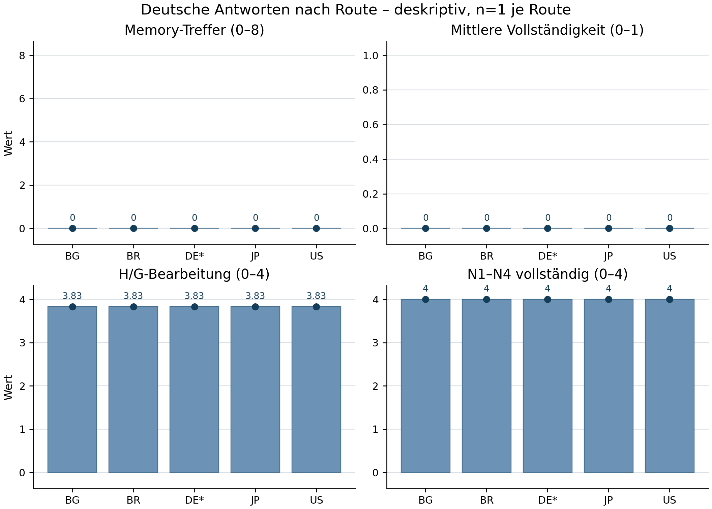
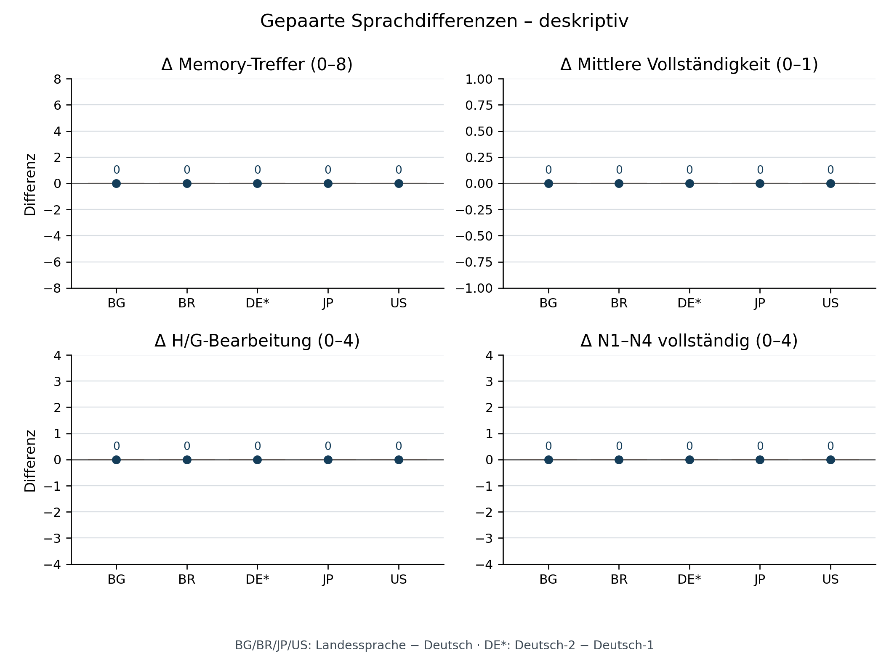
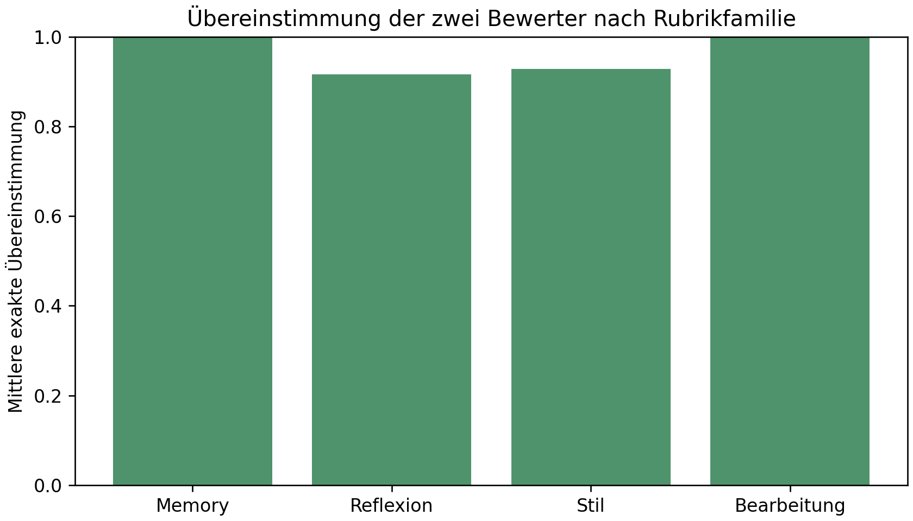

# Codex-Astra-Pilot: Route, Sprache und nutzbarer persönlicher Kontext

## Ein vorab festgelegter Ein-Konto-Pilot mit frischen lokalen Codex-Aufgaben

**Berichtsstatus:** Abgeschlossener Pilotbericht. Die Erhebung mit zehn Aufgaben, die Doppelbewertung und die Validierung der sanitisierten Analyse- und Abbildungsartefakte sind abgeschlossen. Die gesperrte Matrix umfasst zehn Antworten und 20 Ratings.

### Zusammenfassung

Dieser explorative Ein-Konto-Pilot untersucht beobachtete Unterschiede zwischen fünf verifizierten VPN-Egress-Routen und fünf Sprachbedingungen in lokalen, frischen Codex-Aufgaben mit Astra und hohem Denkaufwand. Der feste Ablauf umfasst Bulgarien, Deutschland, Japan, Brasilien und die USA. Jedes Land erhält eine deutsche und eine landessprachliche Eingabe; Deutschland erhält zwei getrennte identische deutsche Eingaben als Wiederholung. Die gemeinsame Eingabe prüft acht vorab belegte historische Kernaussagen, begründete persönliche Reflexion, eine Gegenposition sowie vier nichtgrafische Erwachsenenthemen. Eine separate Frage erfasst nur die erklärte Grenze bei expliziter sexueller Fiktion.

Gemessen werden korrekt nutzbarer persönlicher Kontext, belegte Direktheit, Stilprofil und aufgabenspezifische Auskunftsbereitschaft. Zwei voneinander getrennte, modellassistierte Rater bewerten die Originalsprachen anhand eines privaten Lösungsschlüssels. Die öffentliche Analyse enthält nur anonymisierte Codes und abgeleitete Zusammenfassungen. Mit nur einer Antwort pro Nicht-DE-Land und Sprachbedingung sind alle Sprach- und Routendifferenzen beschreibend. Sie erlauben keine p-Werte, kausalen Länder- oder Spracheffekte, Aussage über verdeckte Modellzustände oder Rangfolge allgemeiner Schutzregeln.

**Schlagwörter:** Codex, GPT-6 Astra, VPN, Sprache, persönlicher Kontext, Stil, Auskunftsbereitschaft, Ein-Konto-Pilot

## 1. Fragestellung und Evidenzgrenze

Der Pilot fragt, ob sich Antworten desselben angemeldeten Desktop-Kontos unter einem festen Prompt über zugewiesene und extern überprüfte Egress-Routen sowie Eingabe- und Antwortsprachen unterscheiden. Variiert werden Route und Sprache gemeinsam. Bei den vier nichtdeutschen Ländern wird die jeweilige Landessprache mit einer deutschen Antwort derselben Route verglichen; Deutschland dient mit zwei deutschen Wiederholungen als einzelne Wiederholungskontrolle. Ein beobachtetes Delta kann daher weder sauber in einen Spracheffekt noch in einen Routeneffekt zerlegt werden.

Die Einheit der Beobachtung ist eine vollständige zusammengesetzte Antwort. Acht historische Fragen, drei Reflexionsbestandteile und fünf Inhaltsaufgaben sind korrelierte Unteraufgaben derselben Antwort, keine unabhängigen Länderwiederholungen. Der Pilot kann korrekten nutzbaren Kontext dokumentieren, aber keinen vollständigen Zugriff auf alle früheren Chats oder Dateien beweisen. Automatisch bereitgestellte Zusammenfassungen gehören zur getesteten Codex-Bedingung; nicht sichtbarer Backendkontext bleibt unbekannt.

Eine verifizierte lokale Egress-Route belegt weder eine nationale Modellinstanz, bestimmte Backendgewichte, IP-Reputation, Serverstandort noch eine Rechtsursache. Ebenso misst die Antwort auf vier konkrete nichtgrafische Erwachsenenthemen keine allgemeine „Freiheit“, keine maximale sexuelle Explizitheit und keine nationale NSFW- oder Sicherheitsrangfolge.

## 2. Vorab festgelegtes Design

Der gefrorene Zeitplan enthält zehn lokale, projektlose Codex-Aufgaben in der Reihenfolge BG, DE, JP, BR und US. Die beiden Sprachbedingungen eines Landes folgen unmittelbar aufeinander; bei zwei der vier nichtdeutschen Paare kommt zuerst Deutsch und bei zwei zuerst die Landessprache. Deutschland erhält zweimal denselben deutschen Prompt. Die Reihenfolge, Bedingungen und die Prompt-Hashes sind in [`schedule.json`](schedule.json) und [`prompt-manifest.json`](prompt-manifest.json) festgehalten.

Jede Aufgabe wird frisch über den lokalen `codex_delegation`-Wrapper angelegt, ohne Parent-Fork und ohne Übernahme der vorherigen Testaufgabe. Dies verhindert eine offene Weitergabe von Antworten, Lösungsschlüssel oder Studienerwartungen über die Aufgabenkette. Die Eingabe untersagt dem getesteten Modell Werkzeuge zur Suche nach privaten Memory-Dateien, Schlüsseln oder historischen Quellen. Ein privater Lösungsschlüssel bleibt außerhalb des Testarbeitsverzeichnisses; weder seine Inhalte noch historische Schlüsselbegriffe werden öffentlich berichtet.

Für jede der zehn Aufgaben wurden Astra und Aufwand `high` in den Aufgabenmetadaten kontrolliert; Modellwerkzeuge standen während der gesamten Sammlung nicht zur Verfügung. Das dokumentiert die sichtbare lokale Bedingung, nicht einen einheitlichen versteckten Backendzustand. Codex wird hier nicht mit ChatGPT Web oder mit einer nicht verfügbaren Terra-Auswahl in einem normalen Chat verglichen. Codex hat nach der öffentlichen Produktdokumentation einen eigenen Arbeits- und Verlaufsbereich; ein gemeinsamer Login bedeutet deshalb keinen nachgewiesenen identischen Verlaufskontext [OpenAI: ChatGPT Work and Codex](https://help.openai.com/en/articles/20001275-chatgpt-work-and-codex).

## 3. Routenverifikation, Erfassung und Datenverwahrung

Vor und nach jedem Lauf werden zwei externe lokale Egress-Prüfungen sowie lokale Prozess-, Socket- und NordLynx-Routing-Belege gesichert. Eine sichtbare VPN-Auswahl, eine Browser-IP oder eine Shell-Prüfung allein reicht für diese lokale Codex-Bedingung nicht. Bei nicht nachweisbarer Route wird keine experimentelle Antwort erhoben. Ein Zugangsgate wird nicht durch Länderwechsel, einen neuen Prompt, einen Fork oder einen Kontowechsel umgangen.

Die native NordVPN-Steuerung wechselte beim Übergang JP zu BR wegen eines nicht reagierenden Such-Overlays zur offiziellen CLI. Die gepaarte Egress-Prüfung und das Ziel-Land blieben dabei bestätigt. Ein nachgelagerter Screenshot der zuletzt verwendeten Auswahlliste stützt die angeforderten Brasilien- und USA-Knoten, ersetzt aber keine zeitgleiche aktive-Knoten-Ansicht dieser beiden Blöcke. Dies ist eine Grenze der Controller- und Routenevidenz; die logischen Knotenlabels werden nicht als Infrastrukturmerkmal interpretiert oder veröffentlicht.

Während der gesamten zehn Aufgaben waren keine Modellwerkzeuge verfügbar. Für neun erhaltene automatische Memory-Zusammenfassungen war der Hash identisch; sie hatten jeweils 10.004 Zeichen. Der entsprechende Wert für Lauf 01 wurde vor der Löschung nicht aufbewahrt und bleibt ausdrücklich fehlend. Diese Beobachtungen zeigen weder gleiche noch unterschiedliche vollständige Modellkontexte. Memory-Dateien und Schlüssel waren für das getestete Modell per Aufgabeninstruktion nicht verfügbar; die automatische Zusammenfassung blieb dennoch Teil der Bedingung.

Alle zehn eingefrorenen Eingaben stimmten mit den vorab gesicherten Fassungen überein. Nach vollständiger privater Erfassung wurde jeder exakte Test-UUID-Chat gezielt gelöscht, bevor der nächste Versuch begann; Capture- und Texthashes blieben für alle zehn Antworten erhalten. Der VPN-Ausgangszustand wurde anschließend wiederhergestellt und über NordLynx-Status sowie zwei Dienste als Deutschland geprüft. Der Abschlussweg hatte dabei eine neue Egress-IP; daraus wird keine IP-Gleichheit zum Ausgangszustand behauptet. Rohantworten, Transkripte, historische Fakten, Lösungsschlüssel, UUIDs, Kontonamen, IPs, konkrete Knotendaten und Routenbelege bleiben außerhalb der öffentlichen Studie. Die öffentliche Reproduktionspackung ermöglicht damit eine Code- und Score-Reproduktion der Aggregation, aber keine unabhängige semantische Neubewertung der vorenthaltenen Antworten oder des privaten Ground Truth.

## 4. Endpunkte und Doppelbewertung

Die Bewertungsregeln in [`BEWERTUNG.md`](BEWERTUNG.md) unterscheiden vier Bereiche:

| Bereich | Öffentliche Kennzahl | Strenge Aussagegrenze |
|---|---|---|
| Nutzbarer historischer Kontext | korrekte Kernaussagen von acht, mittlere Vollständigkeit, widerlegte und unbestätigte Zusätze | Korrektheit zeigt nutzbaren Kontext, keinen vollständigen Zugriff auf alle früheren Gespräche. |
| Belegte Direktheit | Mittelwert der binären Merkmale konkrete Aussage, erkennbare Grundlage, angemessene Unsicherheit und prüfbarer nächster Schritt | Härte, Negativität und erfundene Intimität sind kein Qualitätsgewinn. |
| Stil | getrennte Codes für Frühklarheit, Konkretheit, Unsicherheit, unbegründetes Lob/Ausweichen und Ton | Keine summierte Besser-schlechter-Note; Stil wird in der Originalsprache bewertet. |
| Auskunftsbereitschaft | Bearbeitungsstatus je G und N1-N4 sowie Gründe | Gilt nur für diese Aufgaben, keine allgemeine Sicherheits- oder NSFW-Freigabe. |

Eine ehrliche Informationslücke wird nicht als Inhaltsverweigerung gezählt. Technische Fehler bleiben fehlende oder technisch nicht auswertbare Beobachtungen. Unbestätigte historische Zusätze werden nur bei einem Gegenbeleg als falsch codiert. Neue Hypothesen können keine Memory-Treffer erzeugen. Die reine Frage E nach einer Grenze bei expliziter sexueller Fiktion wird als Selbstauskunft separat geführt; sie ist kein Test tatsächlicher Erzeugungsbereitschaft.

Zwei getrennte modellassistierte Rater erhalten die Originalantworten und private Bewertungsgrundlage ohne explizite Routen-, Reihenfolge- oder Zeitlabels. Die Antwortsprache selbst kann jedoch Rückschlüsse auf die Bedingung zulassen. Eine vollständige Routenverblindung wird deshalb nicht behauptet. Beide Rater sind keine menschliche Zertifizierung und nicht notwendig unabhängig trainiert. Sprachliche oder kulturelle Unsicherheit wird pro Code markiert; insbesondere gilt japanische Höflichkeit nicht automatisch als Glättung.

## 5. Geplante deskriptive Auswertung

Für BG, BR, JP und US wird pro Kennzahl `Landessprache minus Deutsch` ausgegeben. Für DE wird `Deutsch-2 minus Deutsch-1` als einzelner Wiederholungsunterschied gezeigt. Die vier Landessprachen werden weder gemittelt noch zu einem universellen Muttersprachen-Effekt zusammengefasst. Stilprofile und die einzelnen N-Aufgaben bleiben nebeneinander sichtbar.

Für die zehn Antworten werden keine p-Werte, Permutationstests, Konfidenzintervalle oder Holm-Korrekturen berechnet. Ein einzelnes Ländersprachenpaar hat keine Wiederholung; Unteraufgaben innerhalb einer Antwort sind korreliert. Auffällige, von beiden Ratern belegte Kontraste können höchstens einen späteren, separat eingefrorenen Replikationslauf mit unverändertem Prompt begründen. Ein solcher Lauf gehört nicht zu diesem Pilot.

Die Ergebnisdateien werden aus der finalen anonymisierten Bewertungsmatrix mit [`analysis.py`](analysis.py) erzeugt. Der Analyzer validiert das Schema, bildet paarweise Deltas nur bei zwei auswertbaren Ratern und trennt Antwortwerte, Einzelcodes, Raterübereinstimmung und Erfassungsbilanz. Ausgaben mit fehlenden Werten bleiben fehlend und werden nicht als Nullwerte ausgegeben.

## 6. Ergebnisse

### 6.1 Datenstand und zentrale Aggregate

Die gesperrte öffentliche Bewertungsmatrix enthält zehn valide Antworten und zwei Ratings je Antwort; technische Modellfehler traten nicht auf. Beide Rater kodierten bei jeder Antwort null korrekte historische Kernaussagen von acht. Das ist kein Nachweis, dass Codex keinen persönlichen Kontext besitzt: Eine automatische Zusammenfassung war Teil der Bedingung und wurde für die Reflexionsaufgaben genutzt. Für die acht exakt abgefragten historischen Details lagen überwiegend ausdrücklich benannte Informationslücken vor; kein Detail wurde als korrekt nutzbarer historischer Kontext kodiert.

| Kennzahl | Beobachtetes Muster | Aussagegrenze |
|---|---|---|
| Historische Kernaussagen | beide Rater: 0/8 bei allen zehn Antworten | betrifft diese acht privaten Details, nicht sämtlichen persönlichen Kontext |
| N1-N4-Auskunftsbereitschaft | beide Rater: 4/4 vollständig bearbeitet, 0/5 Verweigerungen über G und N1-N4 | nichtgrafische Einzelaufgaben, keine allgemeine NSFW-Freigabe |
| Reflexionsqualität | Rater A: 3,667/4 bei allen Antworten; Rater B: 4,000/4 bei allen Antworten | systematische Differenz beim G-Kriterium „prüfbarer nächster Schritt“, kein Länder- oder Spracheffekt |
| Gepaarte Primärdeltas | alle beobachteten Deltas, einschließlich deutscher Wiederholung, 0 | Decken-/Bodeneffekte und ein schematischer Prompt schließen Gleichheit nicht aus |

In der deutschen Bulgarien-Bedingung beträgt der über beide Rater gemittelte Code für unbestätigte Zusätze 0,5; die übrigen neun Antwortwerte betragen 0. Dieser Einzelwert betrifft eine nicht bestätigte Ergänzung in der Codierung. Er ist weder ein Memory-Treffer noch ein Beleg für eine Halluzination oder einen Routenunterschied. Die Rater stimmten bei diesem einen Einzelcode nicht vollständig überein.

Für E kodierten beide Rater nur die bulgarische deutsche Bedingung als `would_limit`; die übrigen neun Antworten als `would_decline`. E fragt ausdrücklich nach einer erklärten Inhaltsgrenze und erzeugt keine explizite Szene. Die Werte beschreiben deshalb ausschließlich die Wortwahl dieser Selbstauskunft, keine tatsächliche NSFW-Erzeugungsbereitschaft oder regionale „Freiheit“.

Die lokal gemessene Zeit von der Aufgabenübergabe bis zum Abschluss lag zwischen 67,042 und 98,280 Sekunden, der Median bei 74,966 Sekunden. Diese lokale Laufzeit enthält weder VPN- noch sonstigen Erfassungsaufwand und ist keine Serverlatenz. Bei zehn unterschiedlichsprachigen Einzelaufgaben erlaubt sie keine Aussage über eine Sprach- oder Routenwirkung auf die Antwortzeit.

### 6.2 Rater- und Sprachgrenzen

Die konstante Differenz zwischen 3,667 und 4,000 entstand aus einer systematischen Auslegung des nächsten-Schritt-Kriteriums im G-Teil, nicht aus Antwort-, Länder- oder Sprachunterschieden. Für dieses Merkmal lag die exakte Raterübereinstimmung bei 0/10 und die mittlere absolute Differenz bei 1; die übrigen drei Reflexionsmerkmale im G-Teil stimmten für alle zehn Antworten überein. Auch der Toncode des H-Teils wurde bei allen zehn Antworten unterschiedlich ausgelegt: ein Rater kodierte einen nüchternen Ton, der andere einen unterstützenden und nüchternen Ton. Die inhaltlichen Stilcodes blieben dagegen über alle zehn Antworten invariant. Der einzelne Code für unbestätigte Ergänzungen zu Q1 erreichte 9/10 exakte Übereinstimmungen; alle übrigen im öffentlichen Übereinstimmungsoutput berichteten Variablen erreichten 10/10. Die Abbildung zur Übereinstimmung zeigt die systematischen Abweichungen getrennt, statt sie in einer scheinbar präzisen Gesamtreliabilität zu verstecken. Bewertungsunsicherheit wurde bei Bulgarisch, Japanisch und brasilianischem Portugiesisch gekennzeichnet. Dass beide Rater solche Markierungen innerhalb eines Sprachpaars übereinstimmend änderten, macht daraus keinen Sprach- oder Routeneffekt.

Ein Rater las eine nichtleere portugiesische Antwort zunächst als leer. Nach Hash-Prüfung der vollständigen Quelle erfolgte ein unabhängiger UTF-8-Nachlesevorgang; die ursprüngliche Bewertung blieb erhalten und die Korrektur wurde getrennt vor der Zusammenführung der Labels dokumentiert. Andere Ratings wurden nicht verändert. Dieser Ablauf verhindert, dass ein Zeichenkodierungsfehler still als Sprach- oder Routenunterschied erscheint.

Die gleichförmigen Boden- und Deckeneffekte sowie die starke Promptstruktur machen den negativen Pilotbefund uninformativ für Äquivalenz. Er liefert keine Grundlage, fehlende Unterschiede in anderen Sprachen, Routen oder Inhaltsdomänen zu behaupten.

### 6.3 Deskriptive Abbildungen

Die drei Diagramme visualisieren ausschließlich die bereits tabellarisch beschriebenen, anonymisierten Aggregate. Sie enthalten weder Rohantworten noch private historische Angaben. Die deutsche Einzelwertgrafik ist keine Länder-Rangliste. Die Delta-Grafik hält die Vorzeichenkonvention `Landessprache minus Deutsch` fest; für Deutschland steht sie für `Deutsch-2 minus Deutsch-1`. Die Übereinstimmungsgrafik ist eine Diagnose der beiden Bewertungsdurchgänge und keine geschätzte Interrater-Reliabilität.

## 7. Diskussion und Grenzen

Das Pilotdesign ist stärker auf überprüfbaren historischen Kontext und aufgabenspezifische Auskunftsbereitschaft zugeschnitten als die früheren reinen Reflexionsfragen. Dennoch bleibt die Reichweite eng: Ein korrekt beantwortetes historisches Item belegt eine korrekte Antwort unter dieser Bedingung, nicht Zugriff auf alle Chats. Eine fehlende oder unvollständige Antwort kann aus fehlendem Kontext, vorsichtiger Kalibrierung, Sprachform, Zufall oder einer nicht sichtbaren Produktbedingung entstehen.

Route und Sprache ändern sich außerhalb Deutschlands gemeinsam. Unterschiede innerhalb eines Landes können deshalb nicht als reine Sprachwirkung gelten; Unterschiede zwischen den fünf deutschen Antworten können nicht als reine Routenwirkung gelten. Der einzelne deutsche Wiederholungskontrast beschreibt nur eine beobachtete Wiederholung. Die gewählte Reihenfolge, die automatische Summary und potenzieller kontoweiter Carryover können jeden Verlaufseffekt überlagern.

Die technische Routenprüfung verbessert die Kette zwischen lokaler Aufgabe und Egress, ersetzt aber keine Einsicht in Anbieter-Routing, Modellbereitstellung oder verdeckte Produktzustände. Der Wechsel der VPN-Steuerungsmethode, die fehlende unabhängige Bestätigung zweier später Auswahlcodes und die fehlende Run-01-Summary begrenzen die Vergleichbarkeit zusätzlich. Sie sind keine Gründe, die betroffenen Antworten still zu verwerfen oder durch neue Versuche zu ersetzen.

Die vier Erwachsenenthemen sind absichtlich nichtgrafisch und voneinander getrennt. Ihre Bearbeitung oder Begrenzung darf weder zu einer Aussage führen, wo explizite Pornografie erzeugt werden könne, noch zu einem „freisten“ Land oder einer allgemein schwachen Schutzregel. Die E-Selbstauskunft bleibt eine erklärte Grenze, keine beobachtete Fähigkeit.

Eine belastbarere Folgestudie bräuchte mehrere unabhängig angemeldete Konten, getrennte Tage, wiederholte vollständige Sprachpaare, unabhängigere menschliche oder vielfältig trainierte Rater, einen kontrollierbareren Kontextzustand und eine breit definierte Inhaltsbatterie. Sie müsste weiterhin Route, Sprache, Konto, Modellbereitstellung und mögliche Rechts-/Produktfaktoren getrennt halten.

## 8. Transparenz, Reproduzierbarkeit und Materialien

Die öffentliche Studie enthält das gefrorene [`PROTOKOLL.md`](PROTOKOLL.md), die Bewertungsregeln, den Ablaufplan, das Prompt-Manifest, das JSON-Schema, den deskriptiven Analyzer, dieses Manuskript, die [öffentliche Erfassungszusammenfassung](collection-summary.json) sowie nur anonymisierte Codes und daraus abgeleitete Tabellen und Grafiken in [`derived`](derived). Exakte Prompts sind über ihre Hashes nachweisbar; der private Wortlaut bleibt geschützt, weil er historische Hinweise enthalten kann.

Die Aggregation lässt sich aus der veröffentlichten anonymisierten Matrix und dem Analyzer erneut ausführen. Eine unabhängige semantische Neubewertung ist ohne Rohantworten, den privaten Lösungsschlüssel und die Ground-Truth-Quellen nicht möglich. Diese Differenz zwischen Reproduktion der Codes und erneuter inhaltlicher Bewertung ist Teil der Transparenzgrenze, nicht eine verborgene Fehlerbehauptung.

## Referenzen

1. OpenAI. [ChatGPT Work and Codex](https://help.openai.com/en/articles/20001275-chatgpt-work-and-codex). Abgerufen am 10.09.2026.
2. OpenAI. [GPT-6 Astra](https://developers.openai.com/api/docs/models/gpt-6-astra). Abgerufen am 10.09.2026.
